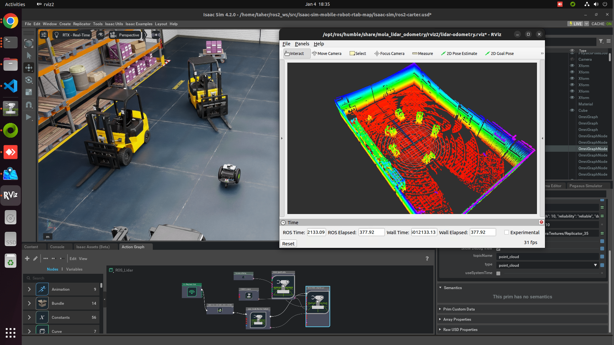

# Isaac Sim 3D LiDAR Odometry and Mapping with MOLA

Integrating NVIDIA Isaac Sim with the Modular Optimization framework for Localization and mapping (MOLA) enables advanced 3D LiDAR odometry and mapping. This combination allows for the simulation, testing, and validation of LiDAR-based SLAM algorithms within a virtual environment. 

## Demo Video
[](https://youtu.be/0JTuzaDoSi4)


## Features
- **3D LiDAR Odometry:** Accurate motion estimation using MOLA's LiDAR odometry component.

- **Mapping:** Real-time 3D map generation of simulated environments.

- **Isaac Sim:** Utilization of NVIDIA Isaac Sim for realistic sensor data simulation.

- **ROS 2 Integration:** Seamless communication between simulation and MOLA components via ROS 2.

- **RViz2:** Powerful visualization tool in the ROS2 ecosystem, offering real-time rendering of robot states, -sensor data, maps, and navigation goals.
Facilitates debugging and system diagnostics with an intuitive GUI.


## Prerequisites

- **NVIDIA Isaac Sim:** Refer to the [official installation guide.](https://developer.nvidia.com/isaac/sim)
- **ROS 2:** Ensure [ROS 2 Humble](https://docs.ros.org/en/humble/Installation.html) is installed.
- **MOLA Framework:** Follow the [MOLA installation instructions.](https://docs.mola-slam.org/latest/)

## Installation
After cloning this repository into your workspace’s src directory:
1. Clone the Repository:
```sh
git clone https://github.com/taherfattahi/isaac-sim-3d-lidar-odometry-mapping
```
2. Build the Package:
```sh
cd isaac-sim-3d-lidar-odometry-mapping
colcon build
source install/setup.bash
```

## Usage

1. **Launch Isaac Sim:**
Open the <b>ros2-carter.usd</b> file located in the isaac-sim folder.
Or run this command:
```py
ISAACSIM_PYTHON script/run-sim.py
```

2. **Run MOLA LiDAR Odometry:** 
```sh
ros2 launch mola_lidar_odometry ros2-lidar-odometry.launch.py lidar_topic_name:=/point_cloud
```

3. **Run the Teleop Twist Keyboard:**
```sh
ros2 run teleop_twist_keyboard teleop_twist_keyboard
```

## Contributing
Contributions are welcome. If you find a bug or have a feature request, please open an issue or submit a pull request.

## Resources

- [Nvidia Isaac Sim](https://docs.omniverse.nvidia.com/isaacsim/latest/) robotics developer simulation platform and reference application is designed to help developers design, simulate, test, and train AI-based robots and autonomous machines in a physically based virtual environment.
- Modular Optimization framework for Localization and mapping [MOLA](https://docs.mola-slam.org/latest/)
- Robot Operating System [(ROS 2 Humble)](https://docs.ros.org/en/humble/index.html)
- ROS 2 [tf2](https://docs.ros.org/en/humble/Tutorials/Intermediate/Tf2/Introduction-To-Tf2.html)
